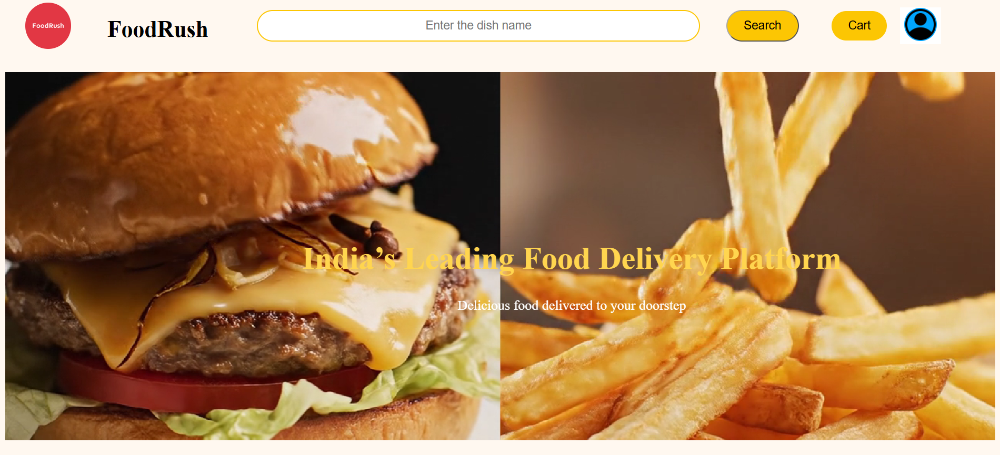
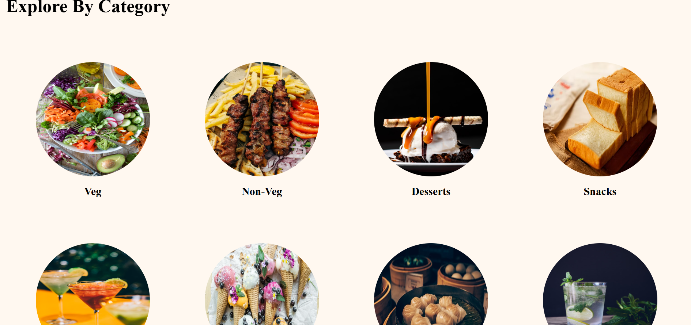
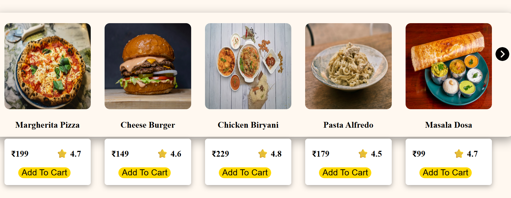
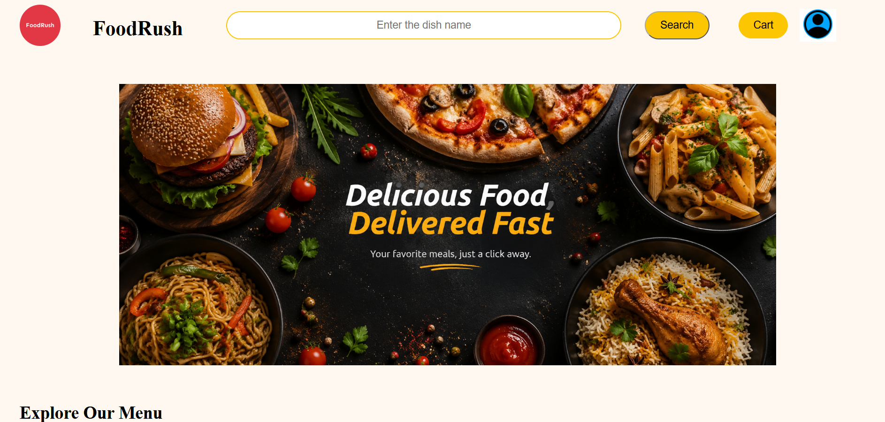
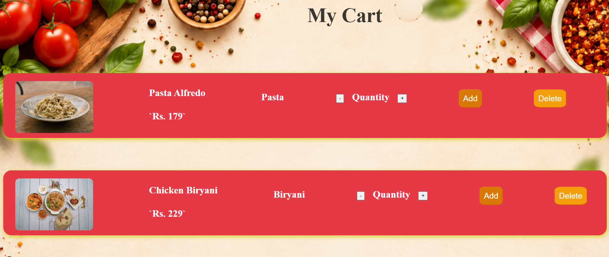
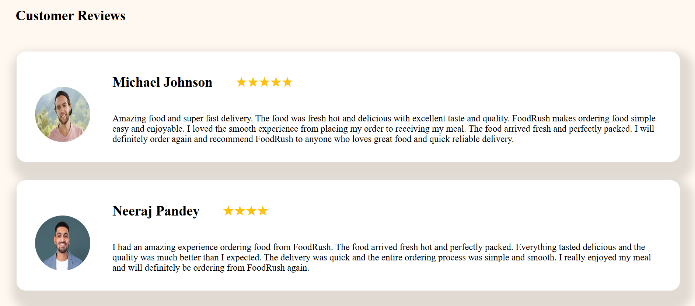

# FoodRush

FoodRush is a food delivery web application made using React Node.js Express.js and MySQL.

## About

I built this project to practice full stack web development and to understand how the frontend backend and database work together.

Users can find restaurants view their menus select food items add them to the cart and check their orders.

Restaurant owners can add their restaurant add food items and manage their menu from the owner section.

## Features

### User

• Signup and login
• View restaurants
• View restaurant menu
• Search and browse food
• Add food to cart
• Manage cart
• View orders
• Manage profile

### Restaurant Owner

• Owner login
• Add restaurant
• Add food items
• Manage food menu
• View restaurant details

## Technologies

React
JavaScript
HTML
CSS
Node.js
Express.js
MySQL
Multer
Bcrypt

## Project Structure

```text
FoodRush
│
├── backend
├── frontend
├── screenshots
├── foodrush.sql
├── .gitignore
└── README.md
```

## Database

MySQL is used for storing users restaurants food items and other application data.

The database setup is available in `foodrush.sql`.

## Screenshots

### Home



### Categories



### Popular Food



### Food



### Cart



### Reviews



## How to Run

First install the required packages.

For frontend:

```bash
cd frontend
npm install
npm run dev
```

For backend:

```bash
cd backend
npm install
node server.js
```

Create the required `.env` file in the backend folder and add your own API key.

Import `foodrush.sql` into MySQL before running the project.

## Author

Aniket Singh

B.Tech Computer Science Engineering
